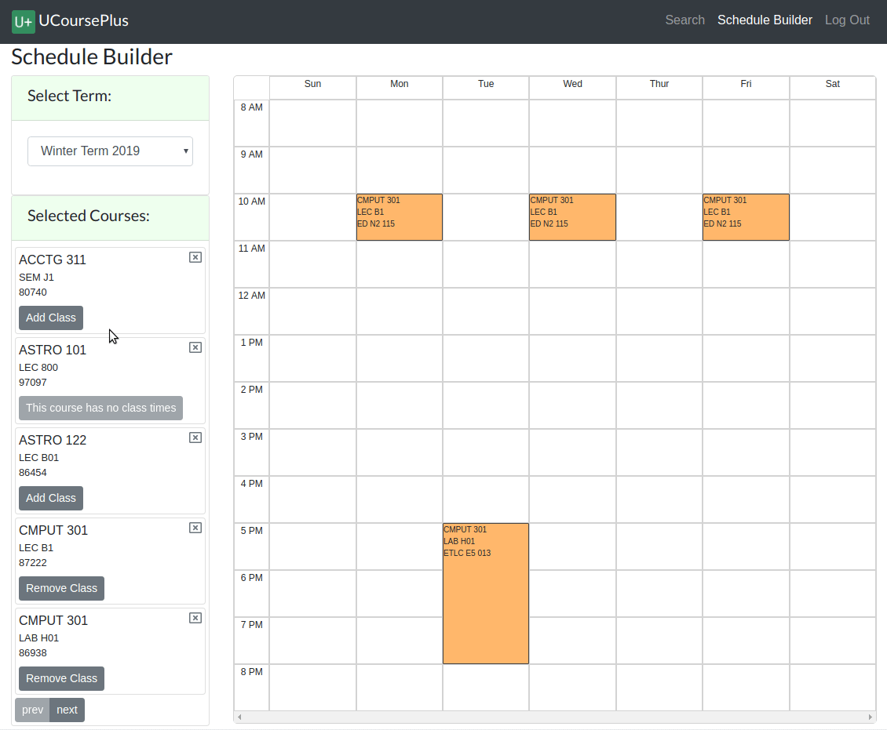

# UCoursePlus

The University of Alberta has a dated course registry web application, which is slow,
complicated, and at times counter-intuitive.
This application attempts to make the workflow of building a course semester quick, simple, and straight forward.
By using modern front-end technologies, this app is also now reactive and responsive.

## End-User Information
### Features
- UCoursePlus now has class times, which now gives it the functionality to build schedules quickly and easily.
- Search up any course within seconds, new or old.
- Annoyances that come with Beartracks is no longer! It's now possible to have multiple windows open,
have the backspace button work reliably, and have the server up on a Saturday night.
- Don't want to log in? No problem. A new guest mode allows users to try out the application, and lets them save
their work locally. 

### Roadmap and Project Status
V1.0 is now out. This application is now in a complete state. Additional features such as mobile first support
and automatic data scraping could make this application highly desirable to the target audience. 

While I plan spending my time on other projects in the near future, this app can be expanded on in order to learn
new concepts or if a limited audience (friends/family) find the app useful. 
### Contributing
This app is open to contributions for anyone who wants to improve the app or hone their development skills.
Feel free to make PRs for any bugfixes, cleanings, or tickets in the projects tab. Contact me if you
have a cool feature/idea you want to implement.
### Credits
Thank you to IST for pointing me to the course calendar database resource.

## Developer Information (Nerd Stuff)
### Architecture
This is a monolithic REST API using Django coupled to a Single Page Application (SPA) in React.
Most choices in technology favoured rapid development speed over cost over performance, due to the limited audience of this app,
and therefore limited traffic.

A React SPA was used to dip my toes into modern front-end software development. While using a SPA arguably made developing
both the front-end and back-end more complex, it does give the app a nice responsive feel, and does open doors
in terms of architecture if I ever wish to swap out the front-end with a mobile client instead.

The database used was SQLite, which was used since the performance of an external database isn't likely to be needed,
and can double the uptime cost for the app.

The backend directly clones any information on the University's database to it's own database,
and then serves any requests using it's own copy.
While this means the backend will never have the most recent data at any given time,
it also means the app is never dependent on the University's database, and can continue to function even if the
database is ever taken down or made private.

### Technologies used
#### Front-end
- React
- Sass
- ES6
- Bootstrap
- HTML5/CSS3
#### Back-end
- Django
- Django REST framework
- SQLite
- AWS
- Nginx
- Gunicorn
- Linux
### Achievements
- A solid understanding and use of the React framework, ES6, and API consumption
- Utilizing the CSS Grid system to display data in a visual manner (used in the schedule component).
- Design and development of a RESTful API
- Extracting and transforming NoSQL data into a normalized SQL schema
- Setting up a server "from scratch" with AWS Lightsail and Nginx
- One step deployment using ssh and shell scripts
### Limitations
The biggest sticking point for me is that any new data in the University's database must be patched in. Even if automation was in place, and even if the scrapes were frequent and efficient, this app would
still have issues determining if a class is full or not, since class availability can wildly fluctuate within a day. 
This to some degree limits the advantages of this app over the current one, since it cannot be reliably used in situations 
where there are only a few seats open. The alternative would be to directly query the 
original database, but again if the database were to ever go down, then so too would this app.
